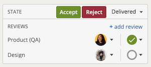
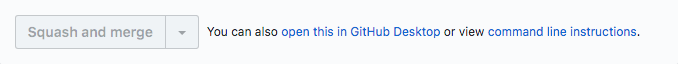

# Darwin

This is our working manifesto, which we keep as a public document. It has details specific to the product, engineering, and data teams, but a lot of it is just about how to work together effectively and bring out the best in each other.

## The Basics

Each member of the team is responsible for making this a great place to work, and for maximizing the power of technology to realize DoSomething's vision: the most young people doing the most good.

### Everything is an Experiment

We're always looking for better ways to work, and end each sprint with a retrospective to find these improvements.

This entire document is just a pull request away from change. The same is true of our team structures and working arrangements. We’ve arrived at our current arrangement through steady evolution, and we’re willing to keep evolving. The qualities we work to protect have to do with how we communicate and respect each other, and how we hold each other accountable to great work and a great attitude. The rest can change.

### Diversity

We know that our diversity — of gender identity, ethnicity, race, sexual orientation, age, education, religion, geography, you name it — makes us better communicators, because it reduces the chance that we'll thoughtlessly agree to a prevailing opinion. We seek out teammates who make us more diverse.

### Trust

As Google’s [Project Aristotle](https://www.nytimes.com/2016/02/28/magazine/what-google-learned-from-its-quest-to-build-the-perfect-team.html) shows, we succeed only when we trust one another. We understand that no one on the team is perfect. When you make a mistake, own up to it and learn from it. Trust is formed by growing and learning from mistakes as a team.

### Communication
While most people are in the New York office, not everyone is, and most people work remotely at least some of the time every week. Communication and documentation are crucial. Make liberal use of the tools we use to include everyone in the conversation: Slack, video chat, Google Drive and Calendar, Pivotal Tracker, and GitHub. 

The rule of thumb should be to err on overcommunication: No one, technical or non-technical, should wonder what Person A is working on or if they are stuck, or the outcome of a meeting.

This is especially important when determining what is appropriate for a private conversation. Avoid using private slacks (DM's) unless absolutely necessary when discussing a topic. We should always lean towards transparency and openness whenever possible, and thus, have conversations in public channels in Slack for the benefit of the team.

Flag issues as soon they come up. If something’s unclear, requirements are incomplete, a suggested approach is causing a headache, etc, discuss what you're unclear about or having trouble with in a public space (Slack, Pivotal ticket, Pull Request).

#### Documentation of Discussions
If a topic is involving a lot of back and forth (> 5 comments) in Slack, a PR, or a ticket, move it to a video call or an in-person meeting. Always document the outcome of the call or in-person discussion.

It is best practice to nominate someone to be in charge of recapping a meeting. The resulting documentation can live in a recap email, a comment in a Slack channel, an update in a Pivotal Tracker ticket, or in a Google document, depending on what is appropriate for that conversation.

#### Courtesy & Respect
Be courteous in communications: The opportunity for misunderstanding is greater with online interactions. Ask if you’re missing some important information. Use emoji. Give context. Read what other people have said before hitting send on your message. Slack is instant, but that doesn't mean you have to reply in an instant.

We have a daily standup thread in [#announce-tech](https://dosomething.slack.com/archives/announce-tech) for our entire team. We expect that everyone posts their standup notes (what was worked on yesterday/what is being  worked on today, and any blockers or other notes) at the start of their day.

If you are going to be out of office (scheduled), please give your team a heads up about this in your team channel after your scheduled time is approved by your manager. Place an OOO block on your calendar. Remind folks in the daily standup thread in [#announce-tech](https://dosomething.slack.com/archives/announce-tech) of your absence at least the day before you're out.

If you’re going to be OOO for a short time during business hours (like for a dr’s appt, etc), put a block on your calendar, and note this in your team channel the day of.

#### Feedback
We encourage feedback in all directions, because it helps us improve. The sooner you're able to provide feedback the better. Within 48 hours is generally a good rule of thumb. A favorite structure for providing feedback is SBI:

* Situation
* Behavior
* Impact

Check out this [10 minute guide](https://www.mindtools.com/blog/corporate/wp-content/uploads/sites/2/2014/05/SBI-Feedback-Tool.pdf) for more on SBI.

Giving feedback to peers is hard. It usually feels awkward. But, when you get constructive, timely, actionable feedback from a peer, you realize it’s gold. It’s what you’ve always wanted to know from your colleagues. We talk about peer feedback a lot, because we realize that it’s both difficult and really valuable.

### Collaboration

When you join DoSomething, you join a team. [Hold strong opinions, weakly](http://blog.codinghorror.com/strong-opinions-weakly-held/). We build products together, and have debates about everything before we build it. We want everyone to be on the same page.

This goes both ways: when explaining something make sure to present enough context for everyone to contribute to the conversation. Conversely, if something is unclear, ask.

We also share responsibility for our work. At Facebook, they say that ["Nothing at Facebook is someone else's problem."](https://medium.com/facebook-design/how-we-changed-the-facebook-friends-icon-dc8526ea9ea8#.tjb5mkj4u) We try to live that—our version is, “It’s everybody’s site.” The products and experiences we create are a direct reflection of the structure of our teams, how we communicate, and what we value.

### Unacceptable Behaviors

_Stolen and hardly adapted from_ [_Vox_](http://code-of-conduct.voxmedia.com/)

We are committed to providing a welcoming and safe environment for people of all races, gender identities, gender expressions, sexual orientations, physical abilities, physical appearances, socioeconomic backgrounds, nationalities, ages, religions, and beliefs. Discrimination and harassment are expressly prohibited in our employee handbook. Harassment includes, but is not limited to, intimidation; stalking; unwanted photography; inappropriate physical contact; use of sexual or discriminatory imagery, comments, or jokes; sexist, racist, ableist, or otherwise discriminatory or derogatory language; and unwelcome sexual attention.

Furthermore, any behavior or language which is unwelcoming—whether or not it rises to the level of harassment — is also strongly discouraged. A lot of exclusionary behavior takes the form of microaggressions: subtle put-downs that may be unconsciously delivered. Regardless of intent, microaggressions can have a significant negative impact on victims and have no place on our team.

There are a host of behaviors and language common on tech teams which are specifically unwelcome: Avoid “well, actuallys”—pedantic corrections that are often insulting and unproductive; make an effort not to interrupt your colleagues while they are speaking; never respond with surprise when someone asks for help; and take care neither to patronize your colleagues nor assume complete knowledge of a topic. This last point is especially important when talking about technical topics: Many women and people of color in the tech industry have many tales of being either [mansplained](https://www.guernicamag.com/daily/rebecca-solnit-men-explain-things-to-me/) about a field in which they are experts, or else excluded from learning opportunities because a colleague wouldn’t make an effort to answer questions. Don’t be that person! Remember, your colleagues may have expertise you are unaware of. Listen more than you speak.

## How We Get Work Done

All of our code is open source and on GitHub. We organize stories and plan sprints with Pivotal Tracker, and maintain our roadmaps in Google Spreadsheets . Individual coding tasks are tracked as Pivotal cards. We use pull requests to review and merge changes. Every PR is peer-reviewed. Please see here for an overview of our [Teams, Services, and Environments](http://docs.dosomething.org/engineering/overview). We communicate on Slack and have [guidelines for this communication](slack.md).

### Sprints

Our sprints are 2 weeks long. We have the following meetings:

- **Sprint Planning**: Individual teams hold sprint planning meetings at the start of the sprint. Work is estimated, tickets are assigned, and the team determines how much they can commit to completing. Everyone is expected to review potential upcoming work prior to sprint planning in order to estimate and discuss the work effectively.  
- **Mega-groom**: The full team meets to discuss work for the upcoming sprint. This is scheduled the week before sprint planning. The meeting has an agenda that is both created by both product managers and tech leads. In addition to providing visibility into upcoming work cross-team, approach and open questions are discussed at a high level. Everyone should review this document prior to the meeting so they can come prepared to discuss the work.
- **Sprint Demos**: Near the end of the sprint on Thursday afternoons, members volunteer to demo what they've worked on. This meeting involves the full team and optionally other department members. Demos should not be overly long or technical as the audience of demos involves non-technical folks. If a deep dive or longer technical demo is desired, we can use the following week's Dev Roundtable (see below about Dev Roundtables) slot.
- **Sprint Retro**: Immediately following demos, we meet to discuss What Went Well, What to To Improve, and Other Discussion Topics. We hold an all-teams retro, which is great for general culture, surfacing larger questions or issues, and providing full team updates. We also typically celebrate a person who’s been a Goddamn Champion (GDC) in having a positive impact through their work over the past sprint. The GDC winner receives a $25 gift card.

_**Another regular meeting to note:** We typically have a brown bag lunch meeting on Wednesdays at noon. It is called Dev Roundtable. These meetings are typically technical and can involve technical demos/presentations, working sessions, or discussions._

Sprints should not be booked more than **75% full**. This gives buffer for sick time, unplanned work, work that was underestimated at the start of the sprint, and breathing room for individual professional development. Additionally, a minimum 3 points of sustaining engineering work should be tackled every sprint. If a team is experiencing sprint rollover, they should step back, and re-evaluate their sprint planning strategy. Sprint rollover should be the exception not the rule.

Additionally, we record best practices as it relates to groom and sprint planning in our [Sprint learnings document](https://docs.google.com/document/d/1SiRF0R73Tg0IBHHCzX5PWAfyXF_Q9TUogxxOyxR-pAM/edit#heading=h.r7t77g3jnbng).

### Ticket Management

All developers are expected to keep their ticket statuses up to date at all times. Just as our communication section details, no one should have to waste time figuring out the state of work. PRs should be linked to the ticket, and questions and comments should be added to the ticket as well. 

Additionally when a ticket is ready for Quality Assurance (QA), notes on how to QA/verify your work must be added as a comment to the ticket, so the person QA-ing the work doesn't have to ask or guess how to verify your work.

Sharing the responsibility for our work extends to ticket management as well. If you see that there's an issue that needs to be captured in a ticket, make the ticket. If you *truly* don't have time to do this, ask your team for help. 

#### Pivotal Tracker
The following outlines the stages of a ticket in Pivotal Tracker. The buttons on a ticket are _Start_, _Finish_, _Deliver_, _Accept_ OR _Reject_, and they will transition a ticket within the different stages.

### ⭐️ Feature OR 🐞 Bug Ticket
1. **Planned**: Ready for current iteration (also estimated if a Feature ticket).
2. **Unstarted**: No work has begun to address the ticket.
3. **Started**: Work has begun to address the ticket. In order to start the ticket, it must be estimated first.
4. **Finished**: Work to address ticket is completed. A pull request has been submitted and is awaiting review.
5. **Delivered**: The pull request has been merged and deployed to a QA environment. The developer has verified their work on this environment and added QA / testing notes to the ticket. At this stage, there will be review by Product, Design, and/or Data. Just as we expect developers to keep their ticket statuses up to date, we expect the same from Reviewers (Unstarted, In Review, Pass, or Revise).
. 
6. **Rejected**: Reviewer (product manager or tech lead) has reviewed the work to address ticket and rejected it.
7. **Accepted**: Reviewer (product manager or tech lead) has reviewed the work to address ticket and accepted it.

### ⚙️ Chore Ticket
1. **Planned**: Ready for current iteration.
2. **Unstarted**: No work has begun to address the ticket.
3. **Started**: Work has begun to address the ticket.
4. **Accepted**: Work to address ticket is completed, pull request was submitted, reviewed and merged.

### Code Review and Pull Requests

We prefer code that's more readable and easier to understand over code that's concise or obfuscated. We strive to use the most understandable variable names in their respective context, and even favor longer, easier to understand variable names over abbreviated ones.

We also prefer DRY code, and favor small, single purpose functions over long functions that try to do too much.

We use these [general guidelines](https://github.com/DoSomething/communal-docs/tree/master/Contributing) to guide how we contribute to our codebases.

We work in branches, generally off of dev (or master, depending on the project). We commit often, to capture our thinking. We package up our work as pull requests, and try to keep PRs reasonably small. (This also makes it more likely someone will review your PR!)

We push changes multiple times a day to (remote) branches. We always push changes at the end of the day.

A teammate must review your PR, get their questions answered, and give a +1 as approval before you can merge your changes. The main branch is [protected](https://help.github.com/articles/about-required-reviews-for-pull-requests/). The reason we review code is not just to catch bugs, but because we want to improve the quality of code that we ship. We want our code to be maintainable, easily understood, and [stylish](https://github.com/DoSomething/code-style). If you push code to production, you’re implicitly vouching for it as an example of how to write code at DoSomething. When possible, we use StyleCI to enforce coding style and conventions. StyleCI gets called for each PR and update.

#### Making a Pull Request

* If your code is not ready for a full review, create a [draft pull request](https://github.blog/2019-02-14-introducing-draft-pull-requests/). These are great for getting initial feedback on a direction you're taking. If it's a prototype that won't be merged, create a pull request prefixed with DON’T MERGE in the title. 
* When you create a pull request, fill out the [pull request template](https://github.com/blog/2111-issue-and-pull-request-templates).
* Highlight any areas you would particularly like review on.

#### Giving Feedback on a Pull Request

* Ask questions, don't make demands.
* Be mindful about how comments come off: "Did you think about" is better than "Why didn't you just..."
* Compliment! If you see something you like, let them know.
* If you see multiple examples of the same thing (spelling, caps) don't comment every time, rather make one comment saying you noticed it throughout.
* Give full context for your comments, so they don’t read as arbitrary.
* If you see a code smell, point them to the [prescription](https://sourcemaking.com/refactoring/smells).
* Use PRs as a learning opportunity - ask questions to learn more even if you don't have specific feedback on the work itself.

#### What Should the Reviewer Look for?

* Does this PR solve the issue it's referencing?
* Is the code readable?
* Is it well commented?

#### Responding to Feedback on your Pull Request

* Don't take comments personally: it should be a conversation, not a personal attack.
* Make sure you understand _why_ you're making the requested changes: Does it make sense? Does it improve the code?
* After you're done implementing the changes, re-ping for a second review!

#### Merging your Pull Request

When merging PRs, make sure to use the "Squash and merge" options so that all commits are squashed into a single commit for what the PR is doing:

After merging a PR, please make sure to delete the branch so that they are cleared from the list of branches for the repository.

### Quality Assurance (QA)

#### Design QA
Generally it takes at least a day to complete Design QA. It is important to note that Design QA is non-blocking for a deploy to Production. However, Design QA review blocks closing the ticket.

#### Developer QA

You should be fully QA-ing your work before you get a second pair of eyes to verify your changes.

We have a [BrowserStack](https://www.browserstack.com/) account (credentials in LastPass) that allows us to verify work on a vast array of devices and browsers. If your change is something small, doing the full review in BrowserStack is not needed, but checking screenshots at small, medium, and large viewport sizes is still required. At minimum, you should check your work on Chrome and Safari.

If it’s a large change / involves a high degree of CSS complexity, please make sure to check your work on BrowserStack and attach screenshots to your ticket before delivering to Design/Product for QA. It is important to check your work on Chrome, Safari, Edge Browsers and on iOS, Windows, Macintosh, Chrome OS, and Android. Check (or ask) Google Analytics for what our top operating systems and browers are if you want to check specific combinations. 

### API Design

We love the book [Build APIs you won't hate](https://leanpub.com/build-apis-you-wont-hate). Follow RESTful standards when dealing with RESTful things, like CRUD operations.

Version your API when making significant changes. With the proliferation of interrelated services in our environment, it can be very difficult to know whether a substantial change to an endpoint you own will have side effects elsewhere. There are [plenty of good resources](http://www.baeldung.com/rest-versioning) out there, as well as established practices at DoSomething. Talk to your fellow engineers to make sure your approach makes sense.

### DevOps

We constantly seek to simplify our toolset and our production environment, because simplicity brings greater understanding, easier automation, more security, and better reliability. \(Simplifying is hard, and takes vigilance.\) A lot of our tech choices are [boring on purpose](http://mcfunley.com/choose-boring-technology).

Devops is handled by the teams themselves. At least two sprints before a new system goes into production, the responsible team needs to figure out and handle \(at least\) these requirements.

* Mission criticality \(an experiment, an add-on, or a new critical service?\)
* Architecture and tech stack walkthrough
* Hosting paradigm: Can this run in a serverless environment?
* Deployment mechanism
* Data storage & backup
* Security and member data privacy
* ETL \(data extraction\) processes
* New Relic and other monitoring integrations
* Milestone dates \(launch, etc.\) on the shared Tech Dates calendar
* QA and Production DNS entries
* LogStash support

Some apps may also require the following support:

* Instrumentation of significant user or business events
* Transactional ID handling \(for instance, with our [Gateway](https://github.com/DoSomething/gateway) project\)
* Runscope or Ghost Inspector tests for monitoring and debugging
* TLS requirements
* Laravel Queue requirements
* [Blink](https://github.com/DoSomething/blink) \(message bus\) integration
* Fastly support

### Deployments

We deploy as often as we can, and look for ways to increase the frequency. We have ChatOps integration through Slack, where possible (e.g., [Heroku](https://devcenter.heroku.com/articles/chatops)).

We use both Jenkins and Wercker for deploys. Wercker is standard for most deploys. Heroku-hosted apps use the standard Heroku deployment workflow.

### Hosting Infrastructure

We host on AWS and Heroku.

#### Heroku

We run as much as we can on Heroku, because that environment puts devs in direct control of the deployment mechanism, and because we reduce our server footprint in AWS.

#### Amazon

The remainder of our environment is hosted in AWS. We make heavy use of EC2, RDS, EBS, and S3.

### Testing & Monitoring

We maintain quality with unit and functional testing, and we’re constantly trying to find better ways to test. We strongly prefer frameworks, like Laravel, that have unit testing built in to their core.

We [monitor](https://github.com/DoSomething/communal-docs/tree/master/Monitoring) with New Relic, StatHat, [Runscope, and Ghost Inspector](https://github.com/DoSomething/communal-docs/tree/master/Automated%20Tests). We centralize alerts and alerting policies in PagerDuty. We have an [Incident Playbook](https://github.com/DoSomething/communal-docs/tree/master/Incidents) and we document common issues we might see for a given service.

Every Wednesday of the month we hold a Post-mortem / Incident review meeting. Tech leads are responsible for creating the tickets generated from the meeting (if they don't exist already) and following up with Product Managers to discuss prioritization. These tickets are placed in the Collective Freezer Pivotal Tracker board. At the start of the meeeting, we review tickets, followup items from the previous month, and discuss the incidents that have occurred.

### Documentation

We believe in great documentation — not for documentation sake, but to make on-boarding and institutional memory better. Writing good docs also makes you more thoughtful about your choices. It's like teaching: you can't teach something you haven't thought through all the way.

We document in code \(doc blocks, etc.\), and in Markdown Readme files in the source repos. Sometimes the project-level Readme is sufficient, but for [bigger projects](https://github.com/DoSomething/northstar/tree/dev/documentation) we'll break the docs into their own directory.

### Data Collection

We collect raw data in our [Quasar](https://github.com/DoSomething/quasar) warehouse; we prefer making apps push their events to the warehouse rather than writing ETL tools to scrape APIs.

We use Looker to surface and explore data.

## Titles & Career Growth

We have a standard set of position levels across the organization:

* Associate
* Manager
* Director
* C-Level

Positions within product and engineering implicitly follow those levels as well, but we add more structure to our job titles because it maps more clearly onto the outside world. We don't want anyone to have an idiomatic title \(“Deputy Chief Monster Imagineer"\) that might be a hindrance to making a great career move after DoSomething.

It's possible to switch between management and technical track—there's not a rigid border. But it's important to know that you can have a rich career in either direction. [This diagram](career-paths.md) further illustrates our career path.

#### Technical Track

* [Junior Software Engineer \(JSE\)](positions/juniorsoftwareengineer.md)
* [Software Engineer \(SE\)](positions/softwareengineer.md)
* [Senior Software Engineer \(SSE\)](positions/seniorsoftwareengineer.md)
* [Senior Software Engineer \(SSE\) with Tech Lead Role](positions/senior-software-engineer-sse-with-tech-lead-role.md)
  * [Technical Lead](positions/techlead.md): This is a role to play on a team, not a job title. The tech team lead serves as the engineering point person for a particular team, helps to define and delegate work, provide estimates, and make architectural decisions. Tech team leads do not manage the other engineers' careers, only their work. There is another version of this role that is technical only \(does not involve leading a team\), meaning that the engineer is responsible for leading, designing, and serving as the main maintainer of a large project/application/service. There is overlap in responsibilities at a high level. Technical leads gather for a monthly architecture governance meeting, where they work together on systems integration and other high-level topics. 
* [Staff Engineer](positions/staffengineer.md)

More information on the roles and responsibilities can be viewed either as a grid [here](https://docs.google.com/spreadsheets/d/1whumiRDUPT3qUrEPtc-k8sCfzYAYrOcU6pCGn8UfNGI/edit?usp=sharing) or on the different position pages linked to above.

#### Engineering Management Track

_We don’t have people in all of these positions, but this is the progression._

* [Engineering Manager](positions/engineering-manager.md)
* [Director of Engineering](positions/director-of-engineering.md)
* [VP of Engineering](positions/vp-of-engineering.md)
* [CTO](positions/cto.md)

